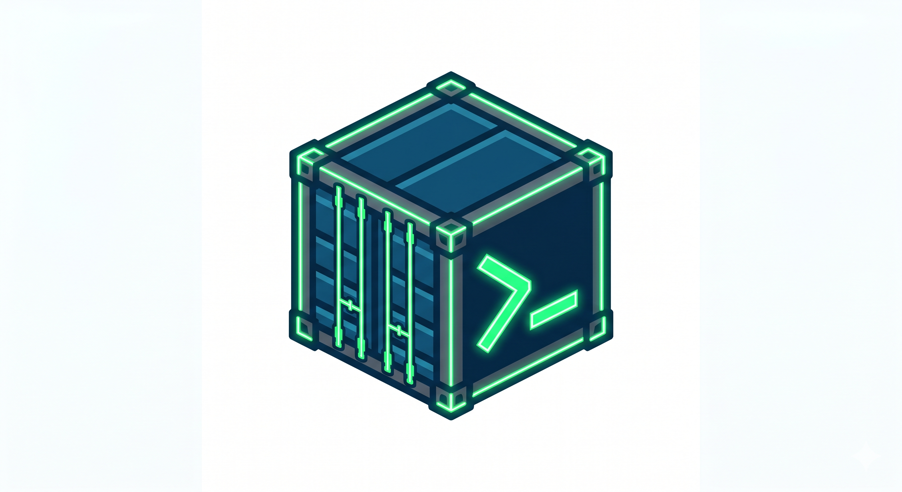

# 🚢 Tuidock

<p align="center">
  
</p>

**Tuidock** is a powerful and intuitive Terminal User Interface (TUI) for managing your Docker containers, images, and networks with ease. Built with Go and the Bubble Tea framework, it provides a seamless experience for developers who love the terminal.

<p align="center">
  
  
  
</p>

## ✨ Features

- 🐳 **Docker Management**: List, start, stop, and remove containers with simple keypresses.
- 🐚 **SSH Support**: Connect to and manage Docker on remote hosts securely over SSH.
- 📊 **Real-time Stats**: Monitor container resource usage and status at a glance.
- ⌨️ **Keyboard Driven**: Fully optimized for keyboard navigation—no mouse required.
- 🎨 **Beautiful UI**: A modern, sleek terminal interface powered by `lipgloss`.

## 🚀 Installation

### ⚡ Quick Install

Tuidock is available as a pre-compiled binary for Linux, macOS, and Windows.

1. **Visit the [Releases](https://github.com/thebanri/tuidock/releases) page.**
2. **Download the archive** for your platform (e.g., `tuidock_0.1.0_Linux_x86_64.tar.gz` or `tuidock_0.1.0_Windows_x86_64.zip`).
3. **Extract the binary** and move it to a directory in your system's PATH.

#### Using curl (Linux & macOS)
```bash
# Example for Linux x86_64 (replace 0.1.0 with the latest version)
curl -L https://github.com/thebanri/tuidock/releases/download/v0.1.0/tuidock_0.1.0_Linux_x86_64.tar.gz | tar xz
chmod +x tuidock
sudo mv tuidock /usr/local/bin/
```

### 🛠️ Manual Installation

If you have Go installed, you can build Tuidock from source:

1. **Clone the repository:**
   ```bash
   git clone https://github.com/thebanri/tuidock.git
   cd tuidock
   ```

2. **Build the project:**
   ```bash
   go build -o tuidock main.go
   ```

3. **Move to your PATH:**
   - **Linux/macOS:** `sudo mv tuidock /usr/local/bin/`
   - **Windows:** Move `tuidock.exe` to a folder in your `%PATH%`.

## 📖 Usage

To launch the interface, simply run:

```bash
tuidock
```

### Keybindings

- `q` / `Ctrl+C`: Quit Tuidock
- `Tab`: Switch between Local and SSH panels
- `Enter`: Select or confirm
- `s`: Start the selected container
- `x`: Stop the selected container
- `r`: Remove the selected container
- `l`: View container logs

## ⚙️ Configuration

Tuidock saves your SSH host configurations in:
- `~/.tuidock.json` (Linux/macOS/Windows)

## 🤝 Contributing

Contributions make the open-source community an amazing place to learn, inspire, and create. Any contributions you make are **greatly appreciated**.

1. Fork the Project
2. Create your Feature Branch (`git checkout -b feature/AmazingFeature`)
3. Commit your Changes (`git commit -m 'Add some AmazingFeature'`)
4. Push to the Branch (`git push origin feature/AmazingFeature`)
5. Open a Pull Request

## 📜 License

Distributed under the MIT License. See `LICENSE` for more information.

---
<p align="center">Built with ❤️ by <a href="https://github.com/thebanri">thebanri</a></p>
